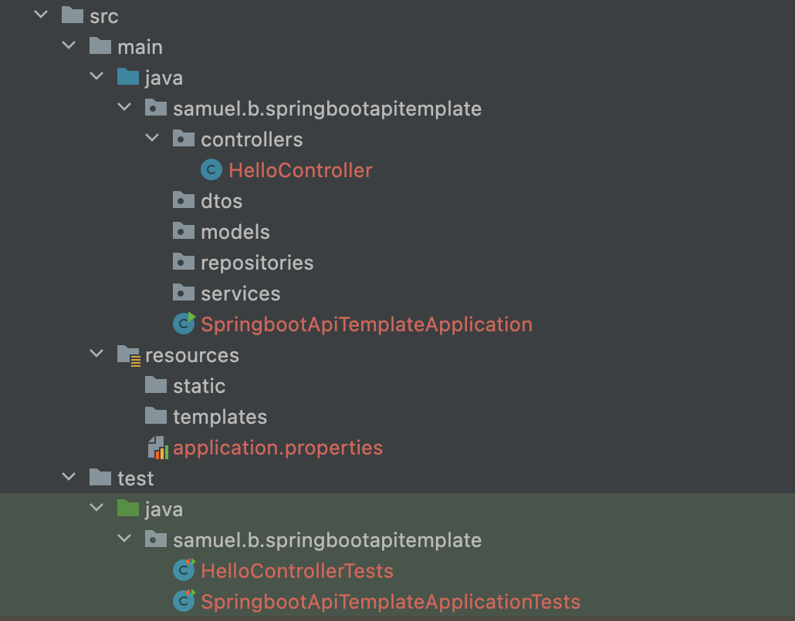

# Spring Boot API Template

## Purpose

A base spring boot base template with pre-configured folder structure, swagger docs, example controller and test to get started quickly.

## Details

| Java | Project | Packaging | Language | Spring Boot |
|------|---------|-----------|----------|-------------|
| 17   | Maven   | JAR       | Java     | 2.7.2       |

## Dependencies
- Lombok
- Validation
- Spring Web
- Spring Boot DevTools
- Springfox Boot Starter

## File Structure

## HelloController
An example controller that contains the below method

| HTTP Method | Endpoint    | Description                |
|-------------|-------------|----------------------------|
| GET         | /api/hellos | Returns the string "hello" |

## HelloControllerTest
An example test that uses MockMvc to perform the above method inside the HelloController that passes if the below conditions are met.

| Status | Content                   |
|--------|---------------------------|
| OK     | .string(equalTo("hello")) |

## Swagger Docs
API documentation is automatically generated using Swagger Docs and available at endpoint /swagger-ui/ (e.g. http://localhost:8080/swagger-ui/)

## Using this template
1. Refactor/Rename filenames and pom.xml (currently springboot-api-template)
2. Add relevant database dependencies in pom.xml
3. Add relevant database connection string in application.properties
4. Modify HelloController to reflect appropriate entity/model and add desired method(s)
5. Modify HelloControllerTests to reflect appropriate methods in relevant controller(s)
